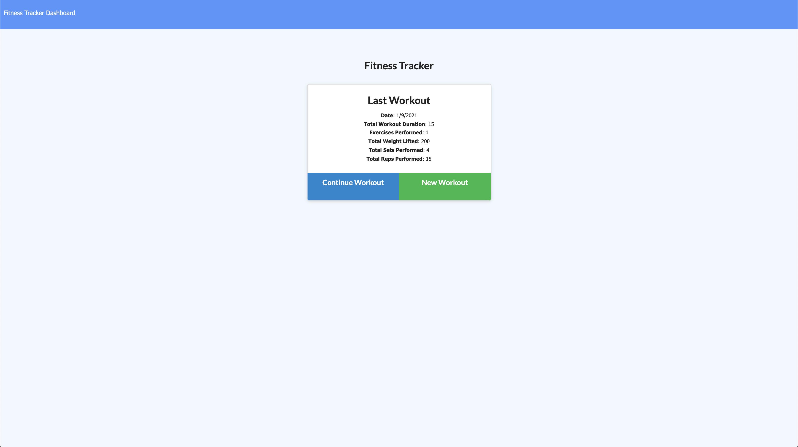
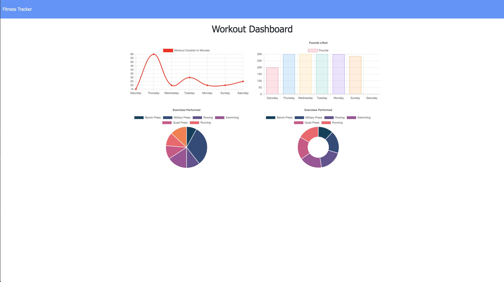
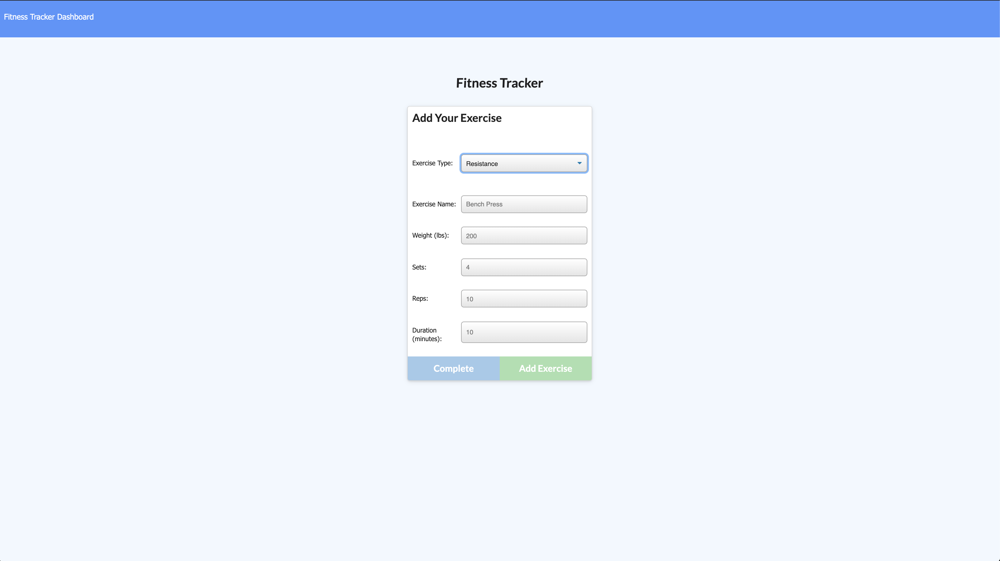

# workout-tracker

## Summary
In this assignment we were tasked with reverse engineering provided code to create a workout tracking app. In order to accomplish this, we deployed to Heroku and used MongoDb. A user can add an exercise to their workout and track their workouts over the course of a week.

## Instruction

Navigate to the following Github repository:
    https://github.com/hsaddanathan/workout-tracker.git

Across the top of the page, click on the Fork button on the right.

Once you have done this, you will see the repo copied within your Github account

Click the Green "Code" Button, and copy repo link. 

Open Terminal and run "git clone (Paste Link Here)"

Once repo has been cloned, you can run " code ." to open in Visual Studio Code. 

From there, open your terminal inside VS Code by using the keyboard shortcut "Ctrl + `. 

Next, type "npm install" to install dependencies.

Once you have done this, type "node server.js".

Then, you can navigate to http://localhost:8080. 

Alternatively, you can navigate to https://safe-waters-82221.herokuapp.com/ and run the program from there.

## Technology Used
    * node.js
    * Javascript
    * Mongoose/ MongoDB / Mongo Atlas
    * Robo 3T
    * Express
    * Morgan
    * Heroku
## Demo

## Links

Workout Tracker Heroku App:
    https://safe-waters-82221.herokuapp.com/

Workout Tracker GitHub Repo:
    https://github.com/hsaddanathan/workout-tracker.git

## Contributors 
[@hsaddanathan](https://github.com/hsaddanathan)

## License
